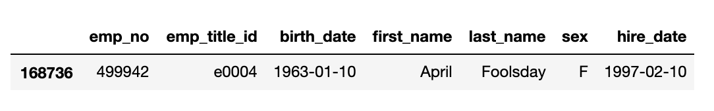

# SQL Challenge - Employee Database: A Mystery in Two Parts


## Background

It is a beautiful spring day, and it is two weeks since I have been hired as a new data engineer at Pewlett Hackard. My first major task is a research project on employees of the corporation from the 1980s and 1990s. All that remain of the database of employees from that period are six CSV files.

In this challenge, I will design the tables to hold data in the CSVs, import the CSVs into a SQL database, and answer questions about the data. In other words, I will perform Data Engineering and Data Analysis.

#### Data Modeling

Sketch out an ERD of the tables via a tool like [http://www.quickdatabasediagrams.com](http://www.quickdatabasediagrams.com).

#### Data Engineering

* Using the information I have to created a table schema for each of the six CSV files. Inside the schema, I specified the data types, primary keys, foreign keys, and other constraints.

* Import each CSV file into the corresponding SQL table. 

* This work could be found in the file named 'schemas.sql'.

#### Data Analysis 
* This work could be found in the file named 'queries.sql'.

1. List the following details of each employee: employee number, last name, first name, sex, and salary.

2. List first name, last name, and hire date for employees who were hired in 1986.

3. List the manager of each department with the following information: department number, department name, the manager's employee number, last name, first name.

4. List the department of each employee with the following information: employee number, last name, first name, and department name.

5. List first name, last name, and sex for employees whose first name is "Hercules" and last names begin with "B."

6. List all employees in the Sales department, including their employee number, last name, first name, and department name.

7. List all employees in the Sales and Development departments, including their employee number, last name, first name, and department name.

8. In descending order, list the frequency count of employee last names, i.e., how many employees share each last name.

## Addtional Analysis 

As I examine the data, I have some suspicions that the dataset is fake. I surmised that my boss handed me spurious data in order to test the data engineering skills of a new employee. To confirm my hunch, I decided to take the following steps to generate a visualization of the data.

1. I imported the SQL database into Pandas. I made some modifications for my username, password, host, port, and database name by using below syntax:

   ```sql
   from sqlalchemy import create_engine
   engine = create_engine('postgresql://localhost:5432/<your_db_name>')
   connection = engine.connect()
   ```

* I utilize [SQLAlchemy documentation](https://docs.sqlalchemy.org/en/latest/core/engines.html#postgresql) for resources.

* If using a password, do not upload your password to your GitHub repository. See [https://www.youtube.com/watch?v=2uaTPmNvH0I](https://www.youtube.com/watch?v=2uaTPmNvH0I) and [https://help.github.com/en/github/using-git/ignoring-files](https://help.github.com/en/github/using-git/ignoring-files) for more information.

2. Create a histogram to visualize the most common salary ranges for employees.

3. Create a bar chart of average salary by title.

## Epilogue

Evidence in hand, I marched into my boss's office and present the visualization. With a sly grin, my boss thanked me for my work. On my way out of the office, I heard the words, "Search your ID number." I looked down at my badge to see that my employee ID number is 499942.



